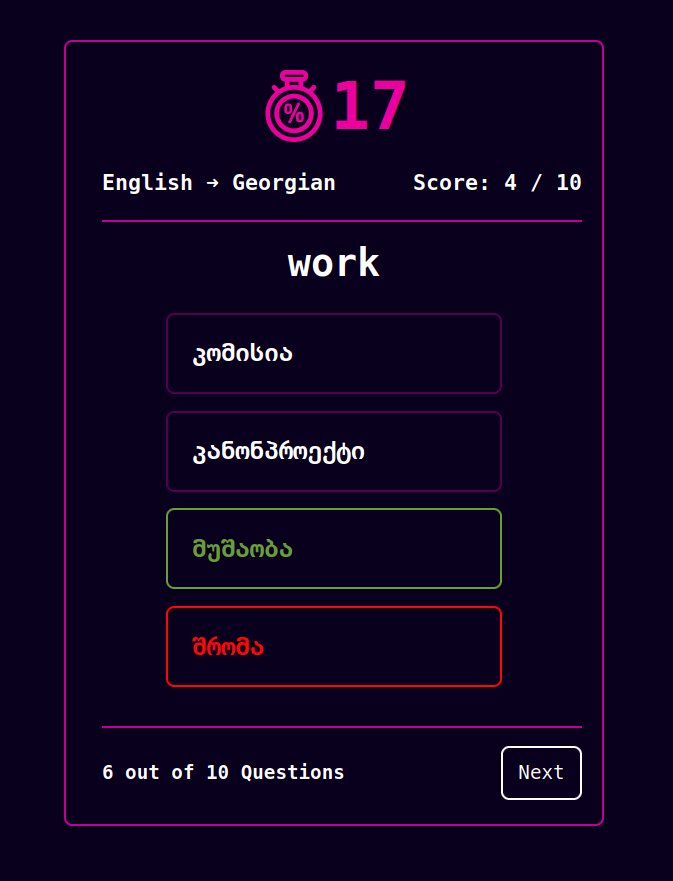

## About The Project

REST API project where users can participate in a quiz consisting of multiple steps.
Each step consists of selecting a correct translation for a word from some given number 
of suggested words.



## Tech Stack
* Spring Framework, Boot, Web, Security, Actuator
* Lombok
* Checkstyle
* Flyway
* Redis, Jedis
* Data JPA, Hibernate
* Swagger

## Prerequisities

* Java JDK
* Maven
* Docker

## Environment variables
```
DB_URL -> Postgres url
DB_USER -> Postgres username
DB_PASSWORD -> Postgres password
REDIS_HOST -> Redis host name
REDIS_PORT -> Redis port
```
## Usage

Build the app:
```
mvn clean install
```
Run app:
```
mvn spring-boot:run
```
Run migration:
```
mvn clean flyway:migrate
```
Run checkstyle:
```
mvn checkstyle:checkstyle
```

## Endpoints
You can use swagger to check out all the endpoint info.
Run the application and use  
```
GET /v3/api-docs
```
or you can use UI interface:
```
GET /swagger-ui.html 
```